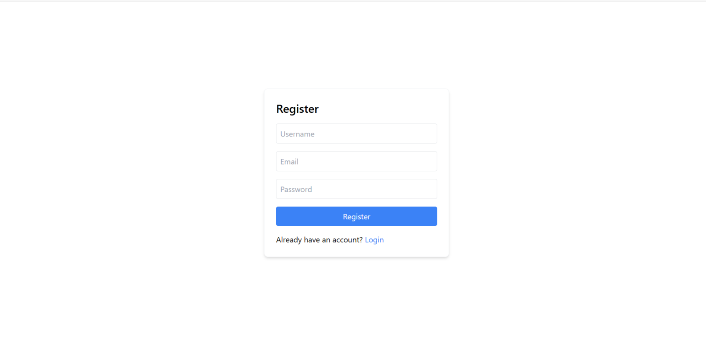
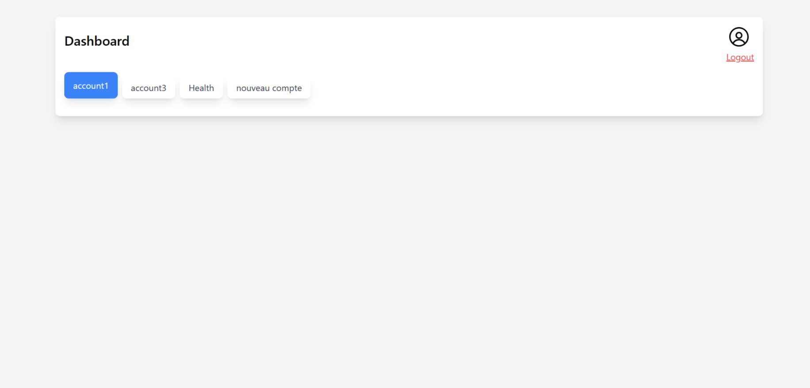
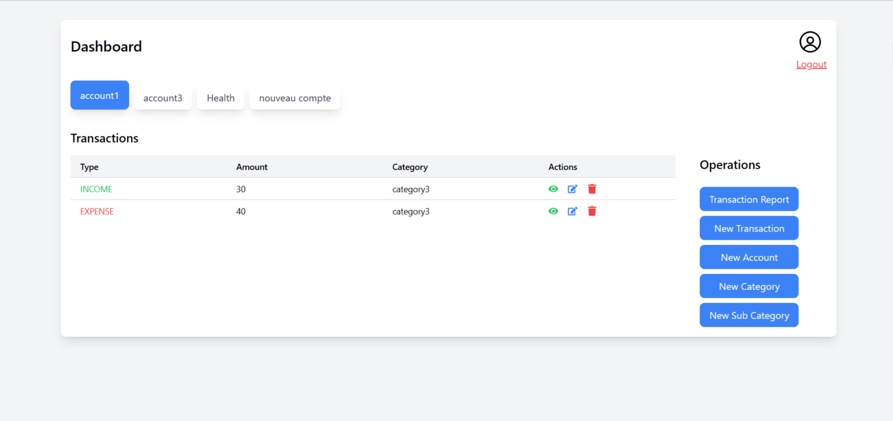
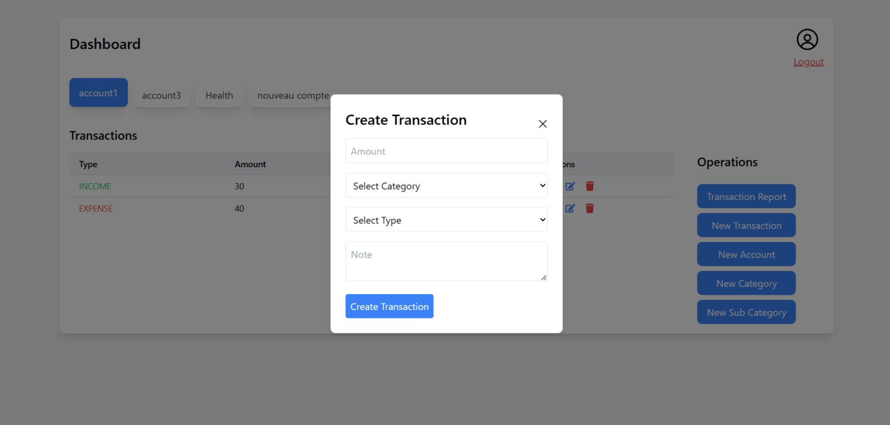

# Wallet Application

Welcome to the Wallet Application, a platform that empowers users to manage their financial transactions and accounts seamlessly. Built using cutting-edge technologies including React, Node.js/Express, MongoDB, and TailwindCSS, this application ensures a smooth and user-friendly experience for tracking financial activities.. 

## API Documentation Link
For detailed API documentation, please visit the [Wallet App API Documentation](https://documenter.getpostman.com/view/6127109/2s9Y5SX5zy)
## Demo Account Credentials
You can use the following demo credentials to explore the application:

#### Email: mwafrikajosue@gmail.com
#### Password: 123456
Alternatively, you can create a new account to test with your own credentials.

## Technologies Used
- React 
- Node.js/Express
- MongoDB
- TailwindCSS
- Vite

## Tools and IDEs
- Vite
- Postman
- vscode

## Getting Started

To set up the application locally, follow these steps:

### Prerequisites

Make sure you have the following tools installed:

- Git
- Node.js

### Setup

1. Clone the repository:

```js 
git clone https://github.com/mwafrika/task-force.git
```

#### 2. Navigate to the project directory:
```js 
cd task-force
```
```js
Create .env files in both the frontend and backend directories, and copy the contents of .env.example into them. Update the credentials as required.
```

## Running the Application

### A. Frontend
  - Navigate to the frontend directory:

   ```js
   cd frontend
   ```
   - Install dependencies:
   ```js
   npm install
   ```
   - Run the development server:
   ```js
   npm run dev
   ```

### B. Backend 
   - Navigate to the frontend directory:

   ```js
   cd backend
   ```
   - Install dependencies:
   ```js
   npm install
   ```
   - Run the development server:
   ```js
   npm start
   ```
   
Remember to update the .env files with the appropriate credentials before starting the servers.


## Screenshots

### 1. Register/Login screen



### 2. Initial Dashboard 
After a successful login, you will be redirected to the dashboard where you can see all your accounts and transactions.



### 3. Track all in and out transactions from each account
To see the transactions associated with a particular account, click on the account name. You will be able to load all the transactions associated with that account.



### 4. Modal to create new records (e.g. new account)



### 5. Generate a report according to the desired time gap.
In order to view the transactions reports, you need to click "Transaction Report button" then select the date interval (starting from when you have created a new transaction) to see the report of transactions associated with that account.


<!-- ## Live Demo -->

<!-- [Live Demo Link]() -->


## Authors

👤 **Mwafrika Josué**

- GitHub: [@mwafrika](https://github.com/mwafrika)
- Twitter: [@mwafrika](https://twitter.com/mwafrika_josue_)
- LinkedIn: [@mwafrika](https://linkedin.com/in/mwafrika-mufungizi)

## 🤝 Contributing

Contributions, issues, and feature requests are welcome!

Feel free to check the [issues page](https://github.com/mwafrika/task-force/issues).

## Show your support

Give a ⭐️ if you like this project!

## Acknowledgments

- Inspiration
- etc

## 📝 License

This project is [MIT](./MIT.md) licensed.


<!-- Please give us a brief summary of your program, what you're proud of, and what you wish you had done to improve it. This question is optional but we will take into account anything you say. -->


