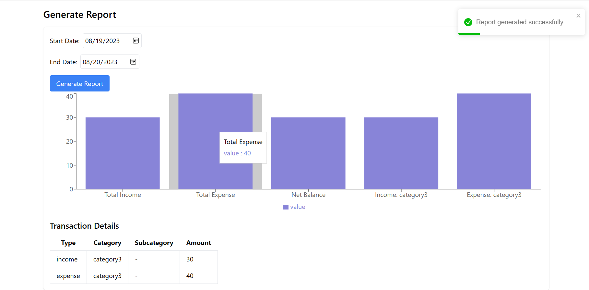

# TASK FORCE CHALLENGE: Wallet Application

This is a wallet application that allows users to create accounts and make transactions. The application is built with React, Node.js/Express, MongoDB and TailwindCSS. 


## Login credentials for testing
#### Email: mwafrikajosue@gmail.com
#### Password: 123456
`You can also create a new account to test with your own account`
## Built With
- React 
- Node.js/Express
- MongoDB
- TailwindCSS
- Vite

## Tools
- Vite
- Postman
- vscode

## Screenshots

### 1. Register/Login screen


### 2. Initial Dashboard 


### 3. Transactions of the selected account


### 4. Modal to create new records (e.g. new account)


### 5. Generated Graphs to show transactions reports



<!-- ## Live Demo -->

<!-- [Live Demo Link]() -->

## Getting Started

**To get local copy up and running the application follow these simple steps:**

### Prerequisites

You need the following tools be installed in your computer:

- Git
- Node.js

### Setup

#### 1. Download the Zip file or clone the repo with:

   `git clone https://github.com/mwafrika/wallet-web-app.git`

#### 2. To access the project directory.

`IMPORTANT:` Create a new file called `.env` in the root directory of the backend folder, and do the same for the frontend folder and copy the contents (Database credentials and others) of `.env.example` to it to be able to run the project.

### A. Frontend
   - `cd wallet-web-app`
   - `cd frontend`
   - `npm install`
   - `npm run dev`

### B. Backend 
   - `cd wallet-web-app`
   - `cd backend`
   - `npm install`
   - `npm run dev` 

``` NOTE:  Make sure to copy paste the .env.example contents to your .env file in the root directory for frontend and backend before running the servers```

### Install

`npm install`

### To run the app locally in the browser use:

`npm run dev --host`

## Authors

👤 **Mwafrika Josué**

- GitHub: [@mwafrika](https://github.com/mwafrika)
- Twitter: [@mwafrika](https://twitter.com/mwafrika_josue_)
- LinkedIn: [@mwafrika](https://linkedin.com/in/mwafrika-mufungizi)

## 🤝 Contributing

Contributions, issues, and feature requests are welcome!

Feel free to check the [issues page](https://github.com/mwafrika/frontend-challenge/issues).

## Show your support

Give a ⭐️ if you like this project!

## Acknowledgments

- Inspiration
- etc

## 📝 License

This project is [MIT](./MIT.md) licensed.


<!-- Please give us a brief summary of your program, what you're proud of, and what you wish you had done to improve it. This question is optional but we will take into account anything you say. -->


